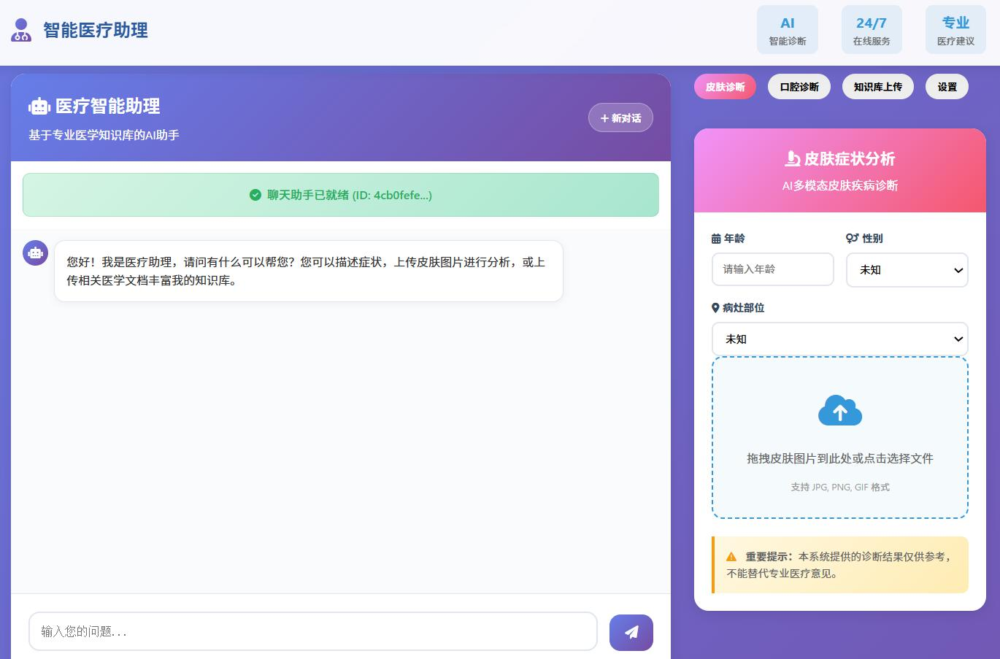
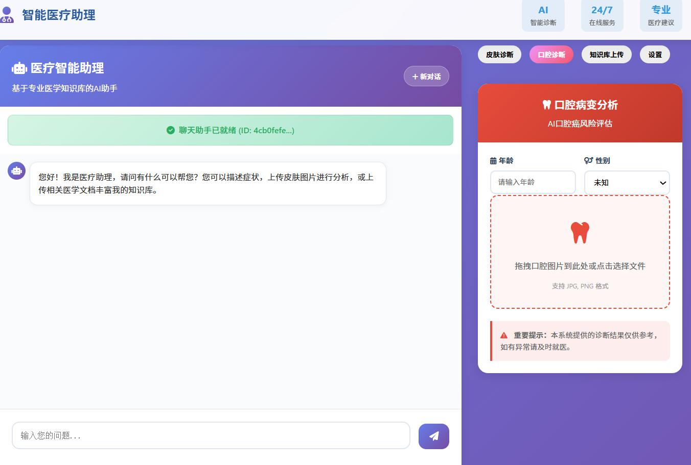
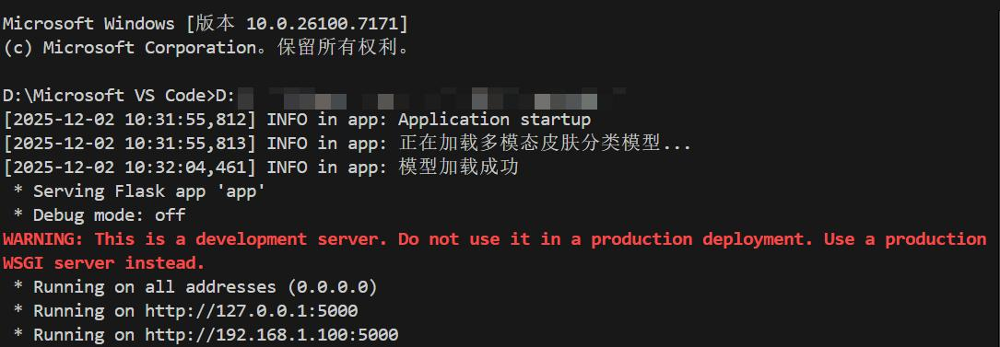
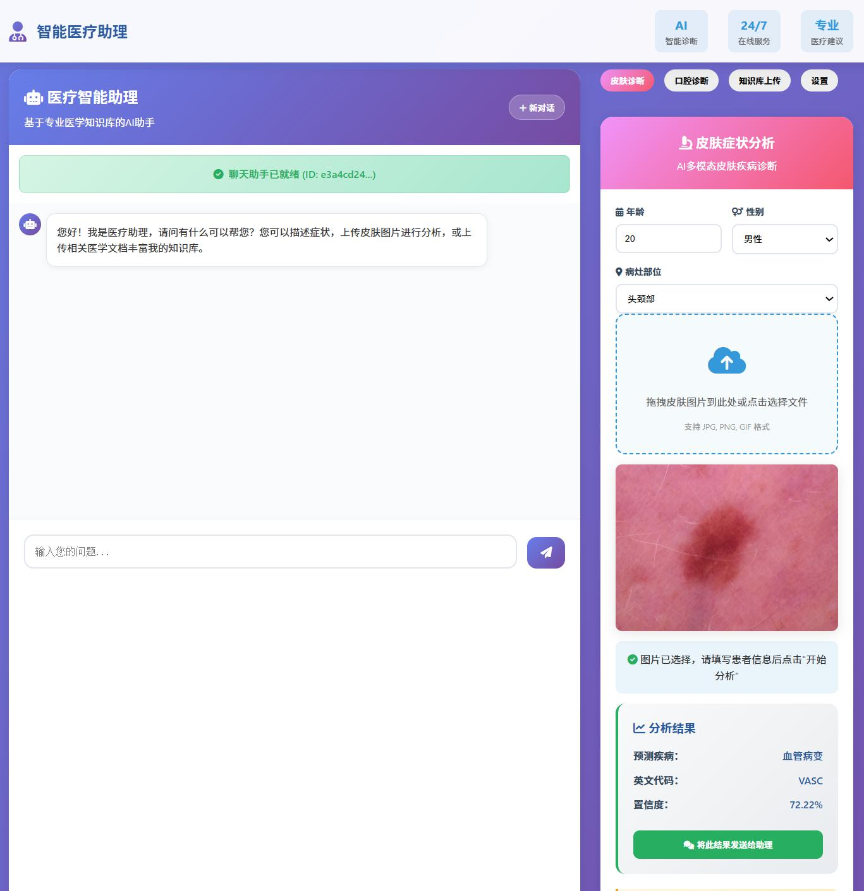
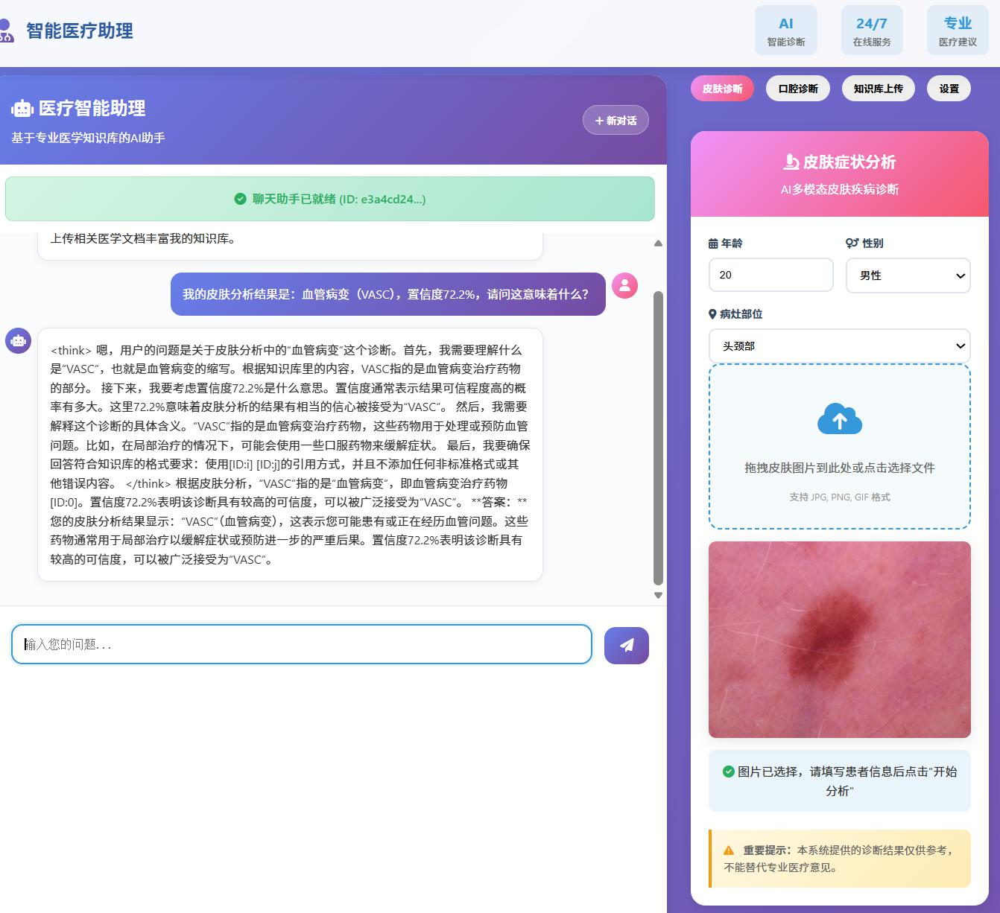
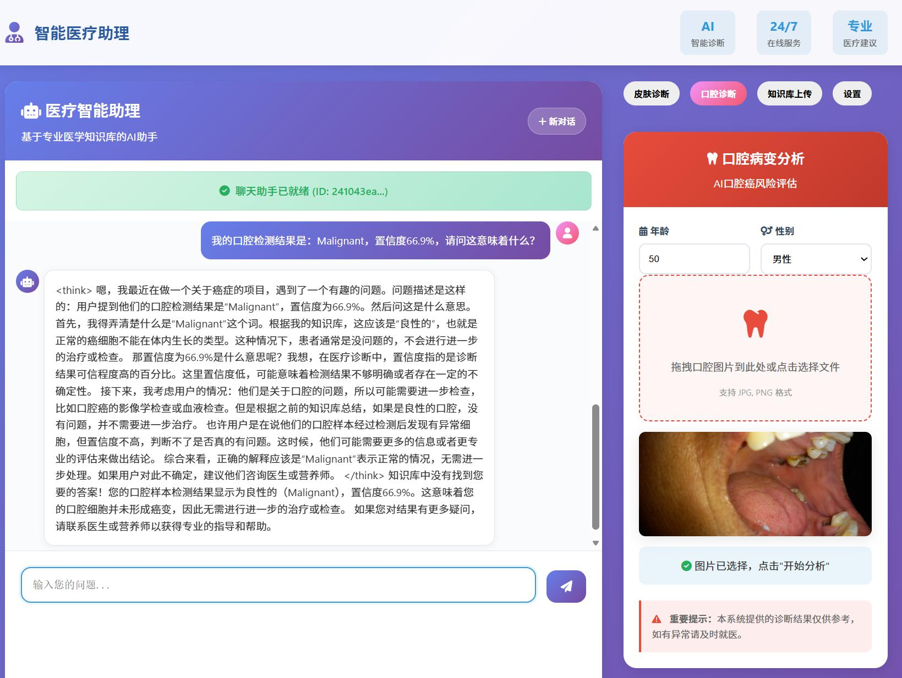
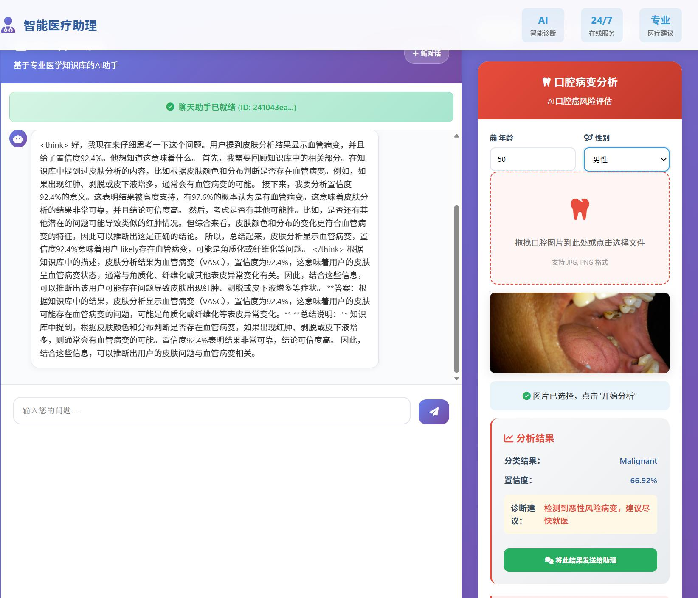
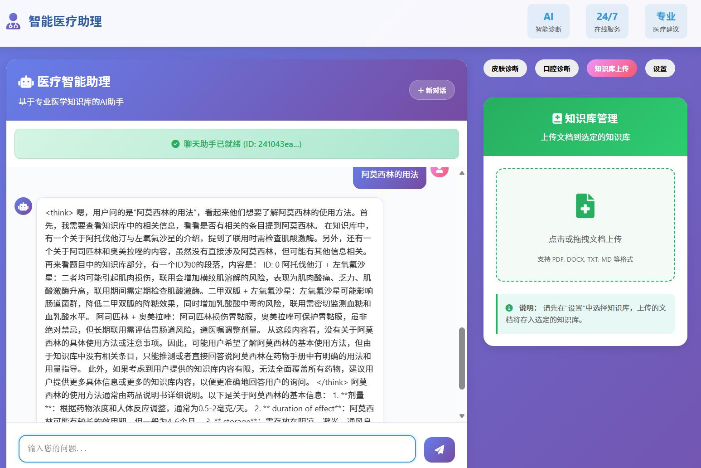
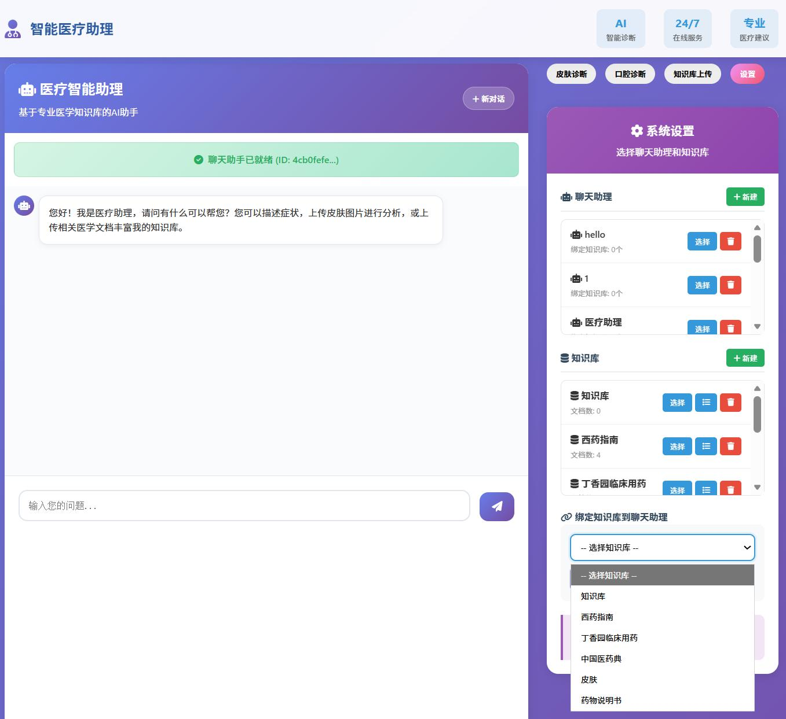

# Smart Healthcare Q&A Assistant

智能医疗助理 — 基于多模态深度学习与 RAGFlow 知识库检索增强的医疗辅助诊断系统。

> **版本号：** V1.0 &nbsp;|&nbsp; **编写日期：** 2025年12月2日

[](https://www.python.org/)
[](https://pytorch.org/)
[](https://flask.palletsprojects.com/)
[](https://github.com/infiniflow/ragflow)
[](LICENSE)

---

## 目录

1. [产品概述](#1-产品概述)
2. [运行环境](#2-运行环境)
3. [功能说明](#3-功能说明)
4. [操作说明](#4-操作说明)
5. [处理流程](#5-处理流程)
6. [技术特点](#6-技术特点)
7. [从零开始部署](#7-从零开始部署)
8. [项目结构](#8-项目结构)
9. [配置说明](#9-配置说明)

---

## 1. 产品概述

### 1.1 产品名称

智能医疗助理

### 1.2 产品用途

本产品是一个基于深度学习技术的医疗辅助诊断系统，主要用于皮肤疾病和口腔疾病的识别与分类。系统集成了多模态深度学习图像模型，能够结合医学图像和患者元数据进行综合分析，为医疗工作者提供辅助诊断参考。

### 1.3 主要功能

| 功能 | 说明 |
|------|------|
| **皮肤疾病智能分类** | 支持黑色素瘤、基底细胞癌、色素痣等多种常见皮肤病的自动识别 |
| **口腔疾病检测分类** | 多阶段检测架构，区分良性病变、炎症性病变和恶性风险 |
| **智能问答系统** | 基于 RAG 技术的医学知识检索增强问答，支持药品查询、疾病咨询 |
| **知识库管理** | 支持医学文档（PDF、Word、TXT）的上传、自动解析和智能检索 |

### 1.4 适用对象

医疗机构、皮肤科医生、口腔科医生、医学研究人员

> **重要提示：** 本系统提供的诊断结果仅供参考，不能替代专业医疗意见。

---

## 2. 运行环境

### 2.1 硬件要求

| 组件 | 最低配置 | 推荐配置 |
|------|---------|---------|
| CPU | Intel Core i5 或同等性能处理器 | Intel Core i7+ |
| 内存 | 8 GB | 16 GB+ |
| 磁盘 | 10 GB 可用空间 | 50 GB SSD |
| GPU | NVIDIA GPU（推荐，支持 CUDA 加速） | NVIDIA RTX 系列 |

### 2.2 软件要求

| 软件 | 版本要求 |
|------|---------|
| 操作系统 | Windows 10/11 或 Linux |
| Python | 3.8 及以上 |
| 深度学习框架 | PyTorch 2.0+ |
| Web 框架 | Flask 3.0+ |
| 浏览器 | Chrome、Firefox、Edge 等现代浏览器 |

### 2.3 依赖库

- **PyTorch / torchvision** — 深度学习模型推理
- **timm** — 预训练模型库（ConvNeXt-Tiny）
- **Pillow / OpenCV** — 图像处理
- **Flask** — Web 服务框架
- **RAGFlow** — 知识库检索引擎
- **pandas / numpy** — 数据处理

---

## 3. 功能说明

### 3.1 皮肤疾病诊断模块

该模块采用多模态 ConvNeXt 深度网络，融合图像特征和患者元数据（年龄、性别、病灶部位）进行综合分析。



*图 1 — 皮肤疾病诊断模型架构*

**支持分类的 8 种皮肤疾病：**

| 英文代码 | 中文名称 |
|---------|---------|
| MEL     | 黑色素瘤 |
| NV      | 色素痣   |
| BCC     | 基底细胞癌 |
| SCC     | 鳞状细胞癌 |
| AK      | 光化性角化病 |
| BKL     | 良性角化病 |
| DF      | 皮肤纤维瘤 |
| VASC    | 血管病变 |

**核心特点：**
- 跨模态注意力池化机制：融合图像与元数据信息
- 模型验证准确率：87.86%

**输入：** 皮肤病变图像、患者年龄、性别、病灶部位

**输出：** 疾病类型、置信度

### 3.2 口腔疾病诊断模块

该模块采用多阶段检测架构，逐步分析口腔病变的良恶性。



*图 2 — 口腔疾病诊断模型架构*

**输入：** 口腔图像、患者年龄、性别

**输出：** 良性/炎症/恶性风险等级、置信度、诊断建议

### 3.3 智能问答模块

基于 RAGFlow 的检索增强生成系统，支持：

- 医学知识问答
- 诊断结果解读
- 药品信息查询
- 多轮对话交互

### 3.4 知识库管理模块

- 支持医学文档的上传与管理
- 支持 PDF、Word、TXT 等格式
- 自动解析文档内容并建立索引
- 支持知识库的创建与删除
- 文档批量导入功能

---

## 4. 操作说明

### 4.1 系统启动



*图 3 — 系统启动界面*

1. 确保 Python 依赖库全部安装
2. 安装依赖：`pip install -r requirements.txt`
3. 运行程序：`python app.py`
4. 浏览器访问：`http://localhost:5000`

### 4.2 皮肤诊断操作



*图 4 — 皮肤诊断操作界面（一）*



*图 5 — 皮肤诊断操作界面（二）*

1. 点击 **「皮肤诊断」** 标签
2. 填写患者信息：年龄、性别、病灶部位
3. 上传皮肤病变图片（支持拖拽）
4. 点击 **「开始分析」**
5. 查看诊断结果（疾病名称、英文代码、置信度）
6. 可将诊断结果发送给 AI 助理进行进一步咨询

### 4.3 口腔诊断操作



*图 6 — 口腔诊断操作界面（一）*



*图 7 — 口腔诊断操作界面（二）*

1. 点击 **「口腔诊断」** 标签
2. 填写患者年龄、性别
3. 上传口腔图像
4. 点击 **「开始分析」**
5. 查看诊断分类结果与诊断建议

### 4.4 智能问答操作



*图 8 — 智能问答操作界面*

1. 在左侧聊天窗口输入医学问题
2. 点击发送或按回车键
3. 等待 AI 智能回复
4. 支持多轮连续对话

### 4.5 知识库管理



*图 9 — 知识库管理界面*

1. 点击 **「管理」** 标签
2. 在下拉菜单选择目标知识库
3. 点击 **「知识库上传」** 标签
4. 上传医学文档（PDF/Word/TXT 等）
5. 等待文档解析完成
6. 将知识库绑定到 AI 助理以供问答使用

---

## 5. 处理流程

### 5.1 图像处理流程

用户上传图像后，系统执行以下处理步骤：

1. 接收用户上传的图像文件
2. 验证图像格式和大小
3. 图像预处理：缩放至 224×224 像素
4. 均值归一化（ImageNet 统计值）
5. 提取患者元数据特征
6. 多模态特征融合
7. 分类器推理
8. Softmax 概率计算
9. 返回分类结果和置信度

### 5.2 问答处理流程

1. 接收用户文本提问
2. 调用 RAGFlow API 接口
3. 检索相关医学知识片段
4. 结合 LLM 大语言模型生成回答
5. 格式化响应内容
6. 流式返回给用户

---

## 6. 技术特点

### 6.1 多模态融合

采用跨模态注意力机制，有效融合图像视觉特征和患者临床元数据，提高诊断准确率。

### 6.2 级联检测架构

口腔诊断采用多阶段级联检测设计，逐级精细化分析，降低误诊率。

### 6.3 知识增强问答

基于 RAG 检索增强生成技术，接入专业医学知识库，提供准确可靠的医学咨询服务。

### 6.4 用户友好界面

响应式 Web 设计，支持拖拽上传，操作直观便捷，适配桌面和移动端。

### 6.5 安全机制

- 文件格式白名单验证
- 上传文件大小限制
- 患者敏感信息过滤
- 临时文件自动清理
- 系统访问日志记录

---

## 7. 从零开始部署

### 第一步：环境准备

确保你的电脑满足 [第 2 章](#2-运行环境) 所述的硬件和软件要求。

### 第二步：安装 RAGFlow

本项目依赖 RAGFlow 提供知识库检索和对话服务，需要先安装并启动 RAGFlow。

```bash
# 克隆 RAGFlow
git clone https://github.com/infiniflow/ragflow.git
cd ragflow

# 使用 Docker Compose 启动所有服务
docker compose -f docker/docker-compose.yml up -d
```

启动后 RAGFlow 默认运行在 `http://localhost:80`。

#### RAGFlow 初始化步骤：

1. 浏览器访问 `http://localhost:80`，注册管理员账号
2. 登录后创建知识库，名称设为 **「药物说明书」**
3. 创建聊天助手，名称设为 **「aa-bot」**
4. 进入 **API 管理**页面，获取 API Key
5. 将获取到的 API Key 和聊天助手 ID 填入 `config.py`

```python
# config.py 中需要修改的配置项
RAGFLOW_AUTHORIZATION = "你的-API-Key"
RAGFLOW_CHAT_ID = "你的-聊天助手-ID"
```

### 第三步：克隆项目并安装依赖

```bash
# 克隆本项目
git clone https://github.com/YuZhongFanXing/Smart-Healthcare-Q-A-Assistant.git
cd Smart-Healthcare-Q-A-Assistant

# 创建虚拟环境（推荐）
python -m venv venv

# Windows 激活
venv\Scripts\activate
# Linux/Mac 激活
source venv/bin/activate

# 安装依赖
pip install -r requirements.txt
```

> 如果使用 GPU 加速，请安装 CUDA 版 PyTorch：
> ```bash
> pip install torch torchvision --index-url https://download.pytorch.org/whl/cu118
> ```

### 第四步：获取模型权重

本仓库使用 Git LFS 管理模型权重文件。克隆后执行：

```bash
git lfs pull
```

模型权重文件位于 `models/weights/best_model.pth`，约 341 MB。

### 第五步：启动应用

```bash
python app.py
```

看到如下输出表示启动成功：

```
 * Running on http://0.0.0.0:5000
[INFO] Application startup
[INFO] 模型加载成功 | 设备: cuda | 类别数: 7 | 元数据维度: 13
[INFO] 聊天助手 ID: be09b0a858df11f0adea8efcd719a948
```

浏览器访问 **`http://localhost:5000`** 即可使用。

---

## 8. 项目结构

```
Smart-Healthcare-Q-A-Assistant/
│
├── app.py                         # Flask 应用主入口
├── config.py                      # 全局配置（模型路径、API 地址、端口等）
├── requirements.txt               # Python 依赖清单
│
├── models/                        # 模型层
│   ├── __init__.py
│   ├── skin_model.py              # 多模态皮肤分类模型定义与预测器
│   └── weights/
│       └── best_model.pth         # 训练好的模型权重（Git LFS，约 341MB）
│
├── services/                      # 服务层
│   ├── __init__.py
│   └── ragflow_service.py         # RAGFlow API 封装（聊天、知识库、文档解析）
│
├── routes/                        # 路由层
│   ├── __init__.py
│   ├── chat_routes.py             # 聊天会话 & 消息路由
│   ├── skin_routes.py             # 皮肤诊断 API 路由
│   └── kb_routes.py               # 知识库上传 API 路由
│
├── templates/                     # 前端模板
│   └── index.html                 # 主页面
│
├── static/                        # 静态资源
│   ├── css/
│   │   └── style.css              # 样式表
│   └── js/
│       └── main.js                # 前端交互逻辑
│
└── docs/                          # 文档资源
    └── images/                    # 说明文档配图（来自软件说明书）
        ├── fig1_skin_model_architecture.jpeg
        ├── fig2_oral_model_architecture.jpeg
        ├── fig3_system_startup.jpeg
        ├── fig4_skin_diagnosis_1.jpeg
        ├── fig5_skin_diagnosis_2.jpeg
        ├── fig6_oral_diagnosis_1.jpeg
        ├── fig7_oral_diagnosis_2.jpeg
        ├── fig8_chat_qa.jpeg
        └── fig9_kb_management.jpeg
```

---

## 9. 配置说明

[config.py](config.py) 中所有可配置项：

| 配置项 | 说明 | 默认值 |
|--------|------|--------|
| `DEVICE` | 推理设备 | 自动检测 `cuda` / `cpu` |
| `MODEL_PATH` | 模型权重路径 | `models/weights/best_model.pth` |
| `IMAGE_SIZE` | 输入图像尺寸 | 224 |
| `NUM_CLASSES` | 分类类别数 | 8 |
| `RAGFLOW_API_URL` | RAGFlow 服务地址 | `http://localhost:80` |
| `RAGFLOW_AUTHORIZATION` | RAGFlow API Key | 需自行配置 |
| `RAGFLOW_CHAT_ID` | 聊天助手 ID | 需自行配置 |
| `RAGFLOW_DATASET_NAME` | 知识库名称 | `药物说明书` |
| `FLASK_HOST` | Flask 监听地址 | `0.0.0.0` |
| `FLASK_PORT` | Flask 监听端口 | `5000` |
| `UPLOAD_FOLDER` | 图片临时目录 | `temp_uploads/` |

---

## 常见问题

**Q: 启动时找不到模型文件？**
执行 `git lfs pull` 拉取模型权重。如果仍失败，请确认 `models/weights/best_model.pth` 存在。

**Q: RAGFlow 连接失败？**
确认 Docker 容器运行正常（`docker ps`），检查 `config.py` 中 API 地址和 Token 是否正确。

**Q: 如何使用 GPU 加速？**
安装 CUDA 版 PyTorch 后系统自动检测并启用 GPU。启动日志会显示 `设备: cuda`。

**Q: 上传的知识库文档 AI 无法引用？**
文档上传后需要等待 RAGFlow 后台完成解析和索引构建。在 RAGFlow 控制台可查看解析状态。

---

## 致谢

- [RAGFlow](https://github.com/infiniflow/ragflow) — 开源 RAG 检索引擎
- [ConvNeXt](https://github.com/facebookresearch/ConvNeXt) — 图像骨干网络
- [timm](https://github.com/huggingface/pytorch-image-models) — PyTorch 预训练模型库
