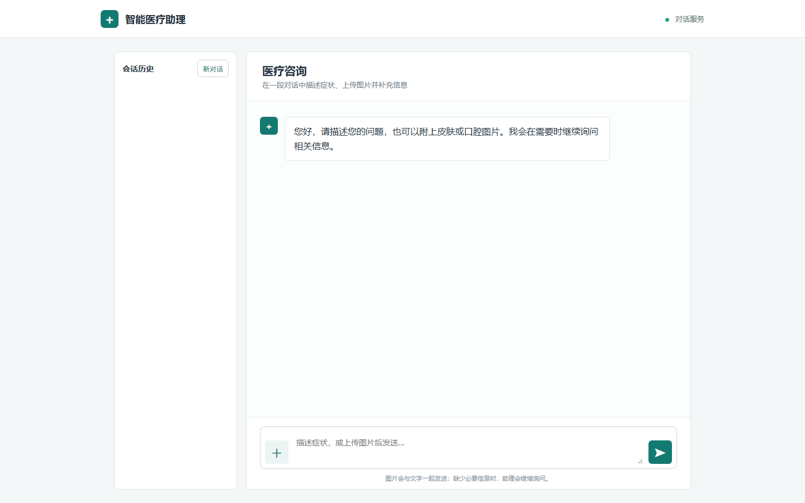

# 智能医疗问答助手

基于 Flask、多模态深度学习、Supervisor Agent 和医学知识检索的医疗辅助问答系统。系统将文本、医学图像、患者元数据和多轮对话放入同一个任务上下文，由 Agent 根据问题选择合适的医学工具。

> 本系统用于医疗信息辅助和科研验证，输出不能替代医生面诊、检查和正式诊断。

## 一、主要能力

- 统一的文本、图片和结构化信息输入；
- 皮肤病变多模态分类：图片结合年龄、性别和病灶部位；
- 口腔病变多模态检测：图片结合年龄、性别和口腔部位；
- 症状分析、医学知识检索、风险评估；
- 药物相互作用和患者历史查询工具接口；
- 内部医学知识库优先，外部检索补充最新信息；
- 多轮对话和主动追问；
- 医学文档上传与知识库管理。

## 二、多 Agent 工作流

当前工作台截图：



### 2.1 统一会话与上下文

用户在同一个对话框中输入文字、上传图片，并通过自然语言补充年龄、性别、病灶位置、症状、用药和患者编号。系统保存 `session_id` 对应的任务上下文，因此 Agent 追问后，用户只需回答问题，不需要重新上传图片。

### 2.2 Agent 角色与工具

| Agent | 负责内容 | 调用工具 |
| --- | --- | --- |
| **Supervisor Agent** | 总控任务，识别意图、拆解任务、维护上下文、安排其他 Agent、汇总结果 | 全部工具 |
| **临床分析 Agent** | 协同症状分析和皮肤、口腔多模态识别 | `symptom_analyzer`、`skin_lesion_classifier`、`oral_lesion_detector` |
| **知识研究 Agent** | 执行 RAG 优先、Web Search 补充和来源核验 | `medical_knowledge_search`、`web_search` |
| **安全建议 Agent** | 综合病史、用药和诊断结果评估风险 | `patient_history_query`、`drug_interaction_checker`、`risk_assessor` |
| **回答生成 Agent** | 将多 Agent 结果整理为带来源、日期、置信度和建议的回复 | GPT API |

皮肤识别所需元数据：年龄、性别、皮肤病灶部位。  
口腔识别所需元数据：年龄、性别、口腔病变部位。

### 2.3 工具清单

| 工具 | 用途 |
| --- | --- |
| `skin_lesion_classifier` | 皮肤图片与患者元数据联合分类 |
| `oral_lesion_detector` | 口腔图片与患者元数据联合检测 |
| `symptom_analyzer` | 文本症状分析 |
| `medical_knowledge_search` | 内部指南、教材和药品知识检索 |
| `web_search` | 最新研究、药物审批和时效性信息检索 |
| `risk_assessor` | 根据诊断结果和症状进行风险评估 |
| `drug_interaction_checker` | 药物相互作用检查 |
| `patient_history_query` | 患者历史查询 |

### 2.4 RAG 与 Web Search 协同决策

每个医学问题都先进入内部医学知识库，只有内部知识不足时才进行外部搜索：

```text
用户问题
  ↓
先查 medical_knowledge_search（内部 RAG）
  ├─ 命中且置信度高 → 使用 RAG，不搜索
  ├─ 命中但信息旧或不全 → 补充 web_search
  └─ 未命中 → web_search
                ↓
          搜索结果过滤
          - 只信权威源：WHO、NIH、NEJM、卫健委、官方药监机构
          - 标注来源、标题和发布日期
          - 过滤广告、营销页面和无法验证的内容
          - 来源冲突时以内部 RAG 为准
```

RAG 负责稳定的指南、教材、药品说明和标准诊疗知识；Web Search 负责最新研究、罕见病进展、新药审批和疫情等时效性内容。两个结果会交给回答生成 Agent 统一整理。

### 2.5 多 Agent 协同流程

```text
用户输入文本、图片和已有信息
    -> Supervisor Agent 创建 TaskContext
    -> 输入理解 Agent 判断场景
    -> 元数据收集 Agent 检查必填项
    -> 信息不足：向用户追问并等待下一轮
    -> 信息完整：并行或串行调用专科 Agent
    -> 知识检索 Agent 执行 RAG/Web 决策
    -> 风险评估 Agent 汇总诊断与风险
    -> 回答生成 Agent 返回最终回复和来源
```

### 2.6 典型场景

**场景一：只有症状文本**

```text
“我最近反复口腔溃疡，很疼”
 -> symptom_analyzer 提取疼痛、反复、口腔溃疡
 -> medical_knowledge_search 查询常见原因和就医指南
 -> risk_assessor 判断是否需要进一步就医
 -> 回答生成 Agent 给出解释、追问和来源
```

**场景二：皮肤图片 + 元数据不完整**

```text
用户上传皮肤图片：“帮我看看”
 -> Supervisor 判断为皮肤图片
 -> 元数据收集 Agent 发现缺少年龄、性别、病灶部位
 -> Agent 追问缺失信息
 -> 用户补充后调用 skin_lesion_classifier
 -> risk_assessor + RAG 解释结果和下一步建议
```

**场景三：口腔图片 + 症状描述**

```text
用户上传口腔图片：“舌头白斑，已经两周了”
 -> 输入理解 Agent 判断为口腔场景
 -> 追问年龄、性别和口腔具体部位
 -> oral_lesion_detector 与 symptom_analyzer 协同
 -> RAG 查询口腔白斑相关指南
 -> risk_assessor 评估持续时间、疼痛和出血信号
```

**场景四：药物相互作用**

```text
“我正在服用药物 A 和药物 B，可以一起吃吗？”
 -> drug_interaction_checker 查询相互作用
 -> medical_knowledge_search 查询官方药品说明
 -> 必要时 web_search 查询最新安全警示
 -> 回答中标注来源、日期并给出咨询医生或药师的建议
```

**场景五：患者历史结合当前问题**

```text
用户提供 patient_id 和新的症状或图片
 -> patient_history_query 查询既往诊断、用药和过敏记录
 -> 图像/症状 Agent 分析当前输入
 -> risk_assessor 对比历史变化
 -> Supervisor 汇总为连续的患者上下文回复
```

## 三、接口

### 统一 Agent 接口

```http
POST /api/agent/chat
Content-Type: multipart/form-data
```

字段包括 `message`、`image` 或 `images[]`、`modality`、`age`、`sex`、`anatom_site`、`oral_site`、`patient_id` 和 `session_id`。

### 兼容接口

- `POST /chat`：文本聊天；
- `POST /predict_skin`：皮肤预测；
- `POST /upload_kb`：知识库文档上传。

## 四、安装与启动

```bash
git clone https://github.com/YuZhongFanXing/Smart-Healthcare-Q-A-Assistant.git
cd Smart-Healthcare-Q-A-Assistant
python -m venv venv
venv\Scripts\activate
pip install -r requirements.txt
python app.py
```

浏览器访问 `http://localhost:5000`。模型权重使用 Git LFS 管理，首次使用时执行 `git lfs pull`。

## 五、配置

敏感配置通过环境变量提供：

```bash
RAGFLOW_API_URL=http://localhost:80
RAGFLOW_AUTHORIZATION=你的API密钥
RAGFLOW_CHAT_ID=你的聊天助手ID
RAGFLOW_DATASET_NAME=药物说明书
RAGFLOW_ASSIST_NAME=aa-bot
FLASK_HOST=0.0.0.0
FLASK_PORT=5000
```

## 六、项目结构

```text
.
├── agents/                 # Supervisor Agent 与任务上下文
├── tools/                  # 医学工具和工具注册表
├── models/                 # 多模态模型
├── routes/                 # Agent、聊天、诊断和知识库接口
├── services/               # RAGFlow 服务封装
├── templates/              # Web 页面
├── static/                 # 前端脚本和样式
├── app.py                  # Flask 应用入口
├── config.py               # 全局配置
└── requirements.txt        # Python 依赖
```

## 七、处理与安全

- 图片进行格式校验和模型预处理；
- 工具结果包含状态、置信度和来源；
- 低置信度结果进入风险评估流程；
- 上传文件使用白名单和临时目录；
- API 密钥通过环境变量管理。

## 八、致谢

- [RAGFlow](https://github.com/infiniflow/ragflow)
- [ConvNeXt](https://github.com/facebookresearch/ConvNeXt)
- [timm](https://github.com/huggingface/pytorch-image-models)
